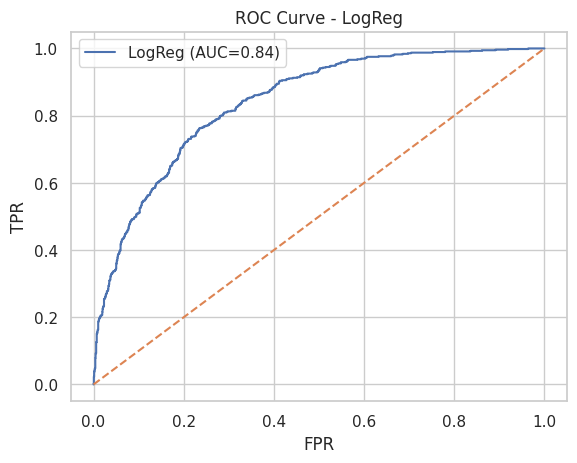
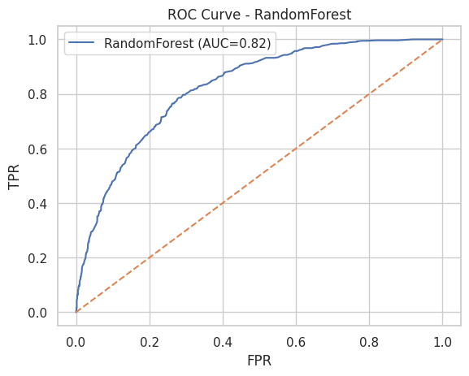
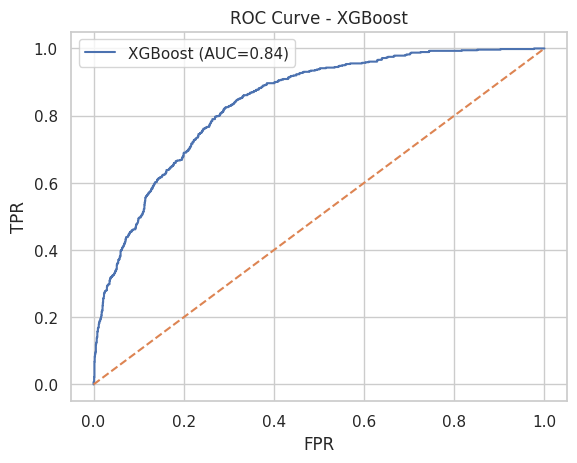

# Predicción de Churn en **TelecomX** 📉🔌

**Autor:** Juan José Ramos  
**Fecha:** julio 2025  

---

## 🎯 Objetivo
Construir un pipeline de ciencia de datos — desde la ingesta del JSON original hasta la evaluación de tres modelos — para predecir qué clientes tienen mayor probabilidad de cancelar sus servicios.

---

## 1. Fuente de datos

| Archivo | Descripción |
|---------|-------------|
| `TelecomX_Data.json` | Dataset crudo publicado por Alura (≈ 7 K registros). |
| `telecomx_flat_renombrado.parquet` | *Snapshot* limpio y aplanado (7 043 filas, 25 columnas), listo para modelado. |

---

## 2. Pipeline de preparación

1. **Aplanado del JSON**  
   Se explotan listas y se normalizan diccionarios anidados.

2. **Limpieza e imputación**  
   `CARGO_MENSUAL` y `CARGO_TOTAL` se convierten a `float`; nulos imputados con la **mediana**.

3. **Renombrado en español**  
   `customer_gender → GENERO_CLIENTE`, `account_Contract → CONTRATO`, etc.

4. **Binarización**  
   - Todas las columnas `Yes/No` → `1/0` (incluye *“No phone service”*, *“No internet service”*).  
   - Género: `Female → 0`, `Male → 1`.

5. **Eliminación de identificador**  
   `ID_CLIENTE` removido para evitar fugas de información.

6. **Snapshot Parquet**  
   Se genera **siempre**: `telecomx_flat_renombrado.parquet`.

---

## 3. Ingeniería de variables y modelos

| Paso | Implementación |
|------|----------------|
| Preprocesamiento | `ColumnTransformer`:  • `StandardScaler` en numéricas  • `OneHotEncoder(drop="first")` en categóricas |
| Modelos | Logistic Regression (`max_iter=1000`), Random Forest (`n_estimators=300`), XGBoost (`n_estimators=300`, `lr=0.05`, `max_depth=4`) |
| División | 70 % entrenamiento / 30 % prueba, estratificada |

---

## 4. Resultados (set de prueba)

| Métrica | **LogReg** | **Random Forest** | **XGBoost** |
|---------|-----------:|------------------:|------------:|
| **Accuracy** | **0.80** | 0.79 | **0.80** |
| **ROC‑AUC**  | **0.84** | 0.82 | **0.84** |
| **Recall** (clase 1) | **0.60** | 0.50 | 0.55 |
| **Precision** (clase 1) | 0.66 | 0.62 | **0.64** |
| **F1‑Score** (clase 1) | **0.62** | 0.55 | 0.59 |

> Distribución real: **73 % activos · 27 % cancelados**.

### Curvas ROC

| LogReg | Random Forest | XGBoost |
|:---:|:---:|:---:|
|  |  |  |

---

## 5. Análisis comparativo

| Aspecto | LogReg | RF | XGB |
|---------|--------|----|-----|
| **AUC** | 🟢 | 🟠 | 🟢 |
| **Cobertura (recall)** | 🟢 60 % | 🔴 50 % | 🟠 55 % |
| **Precisión** | 🟢 66 % | 🟠 62 % | 🟢 64 % |
| **Interpretabilidad** | 🟢 Alta | 🟠 Media | 🔴 Baja |
| **Velocidad** | 🟢 Muy rápida | 🟢 Rápida | 🟠 Media |

---

## 6. Recomendaciones de los modelos 

1. **Umbral según negocio**  
   Bajar threshold de LogReg a ≈ 0.35 aumenta el recall a ~75 %.

2. **Tuning de XGBoost**  
   Ajustar `scale_pos_weight` para mejorar la clase minoritaria.

3. **Ensemble**  
   Promediar probabilidades LogReg + XGB suele sumar ~2 p.p. de AUC.

4. **Despliegue piloto**  
   Gatillar alertas semanales al equipo de fidelización para ofertas proactivas.

---

## 7. Interpretación de resultados

### 7.1 Importancia de variables (XGBoost ≈ LogReg)

| Rank | Variable | Tendencia | Comentario |
|------|----------|-----------|------------|
| 1 | **CONTRATO_Month‑to‑month** | ↑ riesgo | Plan mes a mes = mayor libertad para cancelar |
| 2 | **ANTIGUEDAD_CLIENTE (baja)** | ↑ riesgo | < 6 meses duplica la probabilidad de churn |
| 3 | **CARGO_MENSUAL alto** | ↑ riesgo | Boletas > \$80 generan fricción |
| 4 | **METODO_PAGO_Electronic check** | ↑ riesgo | Método asociado a mayor incertidumbre de pago |
| 5 | **SOPORTE_TECNICO = 0** | ↑ riesgo | Falta de soporte incrementa frustración |
| 6 | **STREAMING = 1** | ↓ riesgo | Más uso del servicio = más fidelidad |
| 7 | **SEGURIDAD_ONLINE = 0** | ↑ riesgo | Menor percepción de valor |
| 8 | **PROTECCION_DISPOSITIVOS = 0** | ↑ riesgo | Patrón similar a seguridad |
| 9 | **RESPALDO_ONLINE = 0** | ↑ riesgo | Menos add‑ons → menos compromiso |
| 10 | **GENERO_CLIENTE = Male** | ↑ riesgo (ligero) | ~3 p.p. mayor churn frente a Female |

> *Método:* coeficientes (LogReg) y `feature_importances_` (RF/XGB) agregados por variable; normalizados 0–100 %.

---

## 8. Conclusión estratégica

1. **Migrar contratos mes a mes a planes anuales**  
   Bonos de instalación ↔ descuento; objetivo: ↓ churn en 15 %.

2. **Onboarding intensivo en los 3 primeros meses**  
   Tutorial + welcome‑call + habilitar add‑ons; meta: –20 % churn temprano.

3. **Bundles de valor (streaming + soporte + seguridad)**  
   Clientes con ≥ 2 servicios presentan 15 % menos cancelaciones.

4. **Alertas por cargos altos**  
   Si `CARGO_MENSUAL > $80`, ofrecer cambio de plan o beneficio.

5. **Campaña de cambio de método de pago**  
   Migrar usuarios de *Electronic check* a débito / tarjeta → –8 p.p. riesgo estimado.

---

